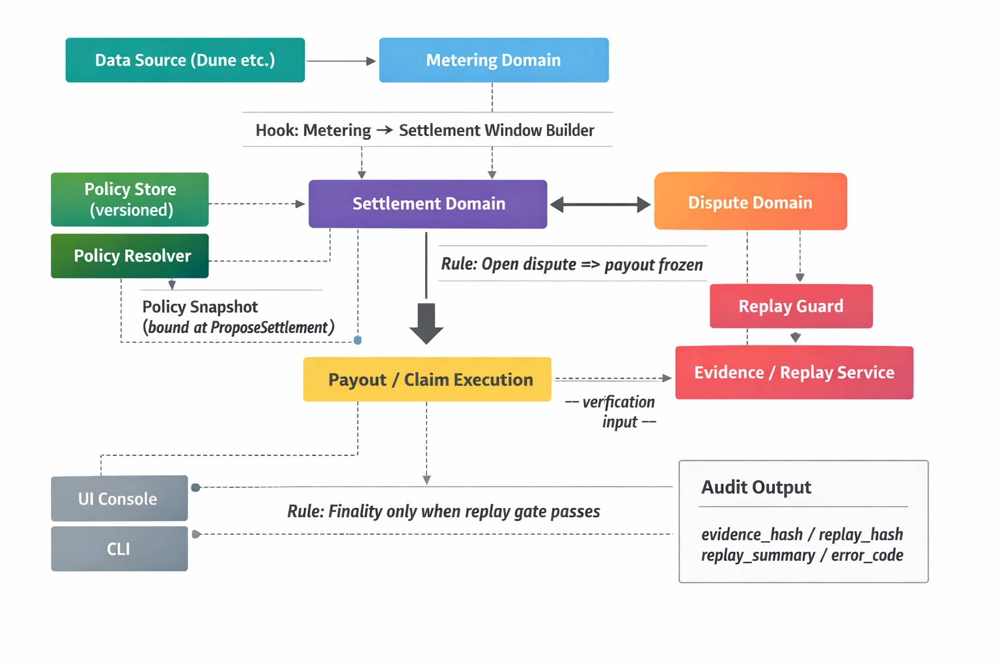

# Metering Chain

[](https://github.com/egpivo/metering-chain/actions/workflows/ci.yml)

Deterministic metering engine for on-chain service usage and billing (Rust).

---

## What it is

A pure state machine that tracks:

* usage
* cost
* balance

with **deterministic and reproducible results**.

Designed for pay-as-you-go and DePIN-style systems.

---

## Installation

```bash
git clone <repo-url>
cd metering-chain
cargo build --release
```

---

## Quick Start

```bash
cargo run --bin metering-chain -- init

# Basic usage flow (unsigned examples; for production use signed tx)
cat examples/tx/01_mint_alice.json | cargo run --bin metering-chain -- apply --allow-unsigned
cat examples/tx/02_open_storage.json | cargo run --bin metering-chain -- apply --allow-unsigned
cat examples/tx/03_consume_storage_unit_price.json | cargo run --bin metering-chain -- apply --allow-unsigned
cat examples/tx/05_close_storage.json | cargo run --bin metering-chain -- apply --allow-unsigned

cargo run --bin metering-chain -- account 0x...A11
cargo run --bin metering-chain -- meters 0x...A11
```

### Signed transactions (Mint → Open → Consume → Close)

End-to-end flow with real signatures (no `--allow-unsigned`):

```bash
./examples/signed/run_signed_demo.sh
```

Creates authority + user wallets, sets `METERING_CHAIN_MINTERS`, then runs Mint, OpenMeter, Consume, CloseMeter with signed tx. See `docs/phase2_signed_demo.md` and `examples/signed/README.md` for manual steps and JSON templates.

### Delegation (signer ≠ owner)

Prove-and-consume flow: reject without proof, accept with capability proof, revoke then reject.

```bash
./examples/phase3_demo/run_phase3_demo.sh
```

See `examples/phase3_demo/README.md` for expected scenes and manual steps.

### Settlement & payouts (propose → finalize → claim → pay)

Propose a settlement window, finalize it, submit operator claims, then pay out. Single binary, in-memory state.

```bash
cargo run --example settlement_demo
```

For disputes, policy, and evidence-backed resolve use the CLI (`settlement`, `dispute`, `policy` subcommands) or the frontend; see `docs/architecture_hook_flow.md` and `frontend/README.md`.

---

## Usage

### Apply a transaction

```bash
# From JSON string
echo '{"signer":"alice","nonce":0,"kind":{"Mint":{"to":"bob","amount":1000}}}' | \
  cargo run --bin metering-chain -- apply --allow-unsigned

# From file
cargo run --bin metering-chain -- apply --file examples/tx/01_mint_alice.json --allow-unsigned

# Dry-run (validate without applying; add --allow-unsigned for unsigned tx)
cargo run --bin metering-chain -- apply --file tx.json --dry-run
```

### Query state

```bash
# Account info
cargo run --bin metering-chain -- account <address>

# Meters for account
cargo run --bin metering-chain -- meters <address>

# Usage report
cargo run --bin metering-chain -- report [<address>]

# JSON output
cargo run --bin metering-chain -- --format json account <address>
```

---

## Features

* Deterministic state transitions
* Usage-based billing
* Auditable receipts
* No database / no side effects

---

## Docs

* `docs/domain_spec.md`
* `docs/state_transitions.md`
* `docs/invariants.md`
* `docs/architecture.md`
* `docs/architecture_hook_flow.md` – Hook flow and apply pipeline
* `docs/error_codes.md` – Error taxonomy for UI mapping
* `docs/validation_flow.md` – Validation pipeline (auth → domain → replay/evidence)
* `docs/naming_conventions.md` – Tx/event naming (Phase 4 ready)

## Architecture

### Core Engine (Deterministic State Machine)

Shows the base transaction engine: deterministic validation, state transitions, and auditable outputs.


### Settlement & Finality Flow (Hook-Based)

Shows how usage becomes settlement decisions with policy snapshots, replay/evidence verification, dispute freeze rules, and payout gating.



---

## License

MIT
