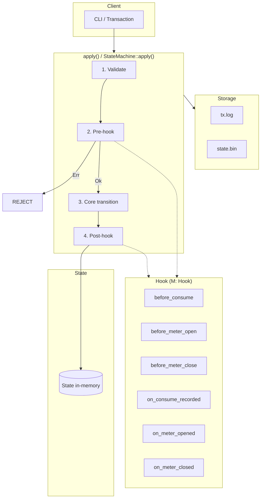

# Metering-Chain: Hook Flow Architecture

Current codebase architecture (G0 refactoring).

## High-Level Flow

```
┌─────────────────────────────────────────────────────────────────────────────┐
│ Client (CLI / Transaction)                                                   │
└──────────────────────────────────────────┬──────────────────────────────────┘
                                           │
                                           ▼
┌─────────────────────────────────────────────────────────────────────────────┐
│ apply(state, tx, ctx, minters)   OR   StateMachine<M: Hook>::apply(...)      │
│                                                                              │
│  1. Validate (signature, auth, domain)                                       │
│  2. Pre-hook (can block: Err → no state change)                              │
│  3. Core state transition (Mint/OpenMeter/Consume/CloseMeter/RevokeDeleg)    │
│  4. Post-hook (record, log)                                                  │
└──────────────────────────────────────────┬──────────────────────────────────┘
                                           │
                         ┌─────────────────┴─────────────────┐
                         ▼                                   ▼
┌──────────────────────────────┐          ┌──────────────────────────────────┐
│ State (in-memory)            │          │ Storage (FileStorage)             │
│ accounts, meters, revoked    │          │ tx.log (append-only)              │
│ capability_consumption       │          │ state.bin (snapshot + next_tx_id) │
└──────────────────────────────┘          └──────────────────────────────────┘
```

## Hook Lifecycle (Consume Example)

```
                    ┌─────────────────┐
                    │ SignedTx        │
                    │ (Consume)       │
                    └────────┬────────┘
                             │
                             ▼
                    ┌─────────────────┐
                    │ validate()      │
                    │ → cost_opt      │
                    └────────┬────────┘
                             │ Ok
                             ▼
                    ┌─────────────────┐
                    │ before_consume  │──── Err ────► REJECT (state unchanged)
                    │ (pre-hook)      │
                    └────────┬────────┘
                             │ Ok
                             ▼
                    ┌─────────────────┐
                    │ apply_consume   │
                    │ (core transition)│
                    └────────┬────────┘
                             │
                             ▼
                    ┌─────────────────┐
                    │ on_consume_     │
                    │ recorded        │
                    │ (post-hook)     │
                    └─────────────────┘
```

## Component Map

| Component | Module | Role |
|-----------|--------|------|
| **apply()** | `state/apply.rs` | Entry point; uses `NoOpHook` by default |
| **StateMachine&lt;M&gt;** | `state/apply.rs` | Orchestrator: validate → pre-hook → transition → post-hook |
| **Hook** | `state/hook.rs` | Trait: before_consume, before_meter_open, before_meter_close, on_* |
| **NoOpHook** | `state/hook.rs` | Default impl (all Ok) |
| **State** | `state/mod.rs` | In-memory: accounts, meters, revoked_ids, capability_consumption |
| **Storage** | `storage/mod.rs` | Trait: append_tx, persist_state, load_state, load_txs_from |
| **FileStorage** | `storage/kv.rs` | tx.log + state.bin |
| **replay_to_tip** | `replay.rs` | Load snapshot, replay txs from next_tx_id to tip |

## Tx Types → Hooks

| Tx Type | Pre-hook | Post-hook |
|---------|----------|-----------|
| Mint | — | — |
| OpenMeter | before_meter_open | on_meter_opened |
| Consume | before_consume | on_consume_recorded |
| CloseMeter | before_meter_close | on_meter_closed |
| RevokeDelegation | — | — |

## Replay Cursor (next_tx_id)

```
tx.log:     [tx0][tx1][tx2][tx3]...
            └─────────────┘
            snapshot state (next_tx_id=2)

replay:     load_state → (state_2, next_tx_id=2)
            load_txs_from(2) → [tx2, tx3, ...]
            apply loop → final state, next_tx_id=4
```

## Mermaid Diagram (render in GitHub/GitLab/etc.)


