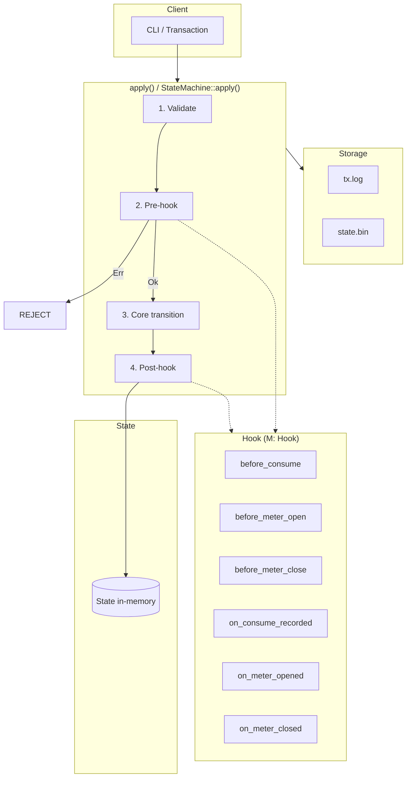

# Metering-Chain: Hook Flow Architecture

Current codebase architecture (through G2: Settlement + Dispute).

## High-Level Flow

```
┌─────────────────────────────────────────────────────────────────────────────┐
│ Client (CLI / Transaction)                                                   │
└──────────────────────────────────────────┬──────────────────────────────────┘
                                           │
                                           ▼
┌─────────────────────────────────────────────────────────────────────────────┐
│ apply(state, tx, ctx, minters)   OR   StateMachine<M: Hook>::apply(...)      │
│                                                                              │
│  1. Validate (signature, auth, domain)                                       │
│  2. Pre-hook (can block: Err → no state change)                              │
│  3. Core state transition (+ Phase 4A/4B: Settlement, Claim, Dispute)        │
│     Mint | OpenMeter | Consume | CloseMeter | RevokeDelegation | ProposeSettlement │
│     FinalizeSettlement | SubmitClaim | PayClaim | OpenDispute | ResolveDispute│
│  4. Post-hook (record, log)                                                  │
└──────────────────────────────────────────┬──────────────────────────────────┘
                                           │
                         ┌─────────────────┴─────────────────┐
                         ▼                                   ▼
┌──────────────────────────────┐          ┌──────────────────────────────────┐
│ State (in-memory)            │          │ Storage (FileStorage)             │
│ accounts, meters,            │          │ tx.log (append-only)              │
│ revoked_capability_ids,      │          │ state.bin (snapshot + next_tx_id) │
│ capability_consumption,      │          │                                  │
│ settlements, claims, disputes│          │                                  │
└──────────────────────────────┘          └──────────────────────────────────┘
```

## Hook Lifecycle (Consume Example)

```
                    ┌─────────────────┐
                    │ SignedTx        │
                    │ (Consume)       │
                    └────────┬────────┘
                             │
                             ▼
                    ┌─────────────────┐
                    │ validate()      │
                    │ → cost_opt      │
                    └────────┬────────┘
                             │ Ok
                             ▼
                    ┌─────────────────┐
                    │ before_consume  │──── Err ────► REJECT (state unchanged)
                    │ (pre-hook)      │
                    └────────┬────────┘
                             │ Ok
                             ▼
                    ┌─────────────────┐
                    │ apply_consume   │
                    │ (core transition)│
                    └────────┬────────┘
                             │
                             ▼
                    ┌─────────────────┐
                    │ on_consume_     │
                    │ recorded        │
                    │ (post-hook)     │
                    └─────────────────┘
```

## Component Map

| Component | Module | Role |
|-----------|--------|------|
| **apply()** | `state/apply.rs` | Entry point; uses `NoOpHook` by default |
| **StateMachine&lt;M&gt;** | `state/apply.rs` | Orchestrator: validate → pre-hook → transition → post-hook |
| **Hook** | `state/hook.rs` | Trait: before_consume, before_meter_open, before_meter_close, on_* |
| **NoOpHook** | `state/hook.rs` | Default impl (all Ok) |
| **State** | `state/mod.rs` | In-memory: accounts, meters, revoked_capability_ids, capability_consumption, settlements, claims, disputes |
| **Storage** | `storage/mod.rs` | Trait: append_tx, persist_state, load_state, load_txs_from |
| **FileStorage** | `storage/kv.rs` | tx.log + state.bin |
| **replay_to_tip** | `replay.rs` | Load snapshot, replay txs from next_tx_id to tip |

## Tx Types → Hooks

| Tx Type | Pre-hook | Post-hook |
|---------|----------|-----------|
| Mint | — | — |
| OpenMeter | before_meter_open | on_meter_opened |
| Consume | before_consume | on_consume_recorded |
| CloseMeter | before_meter_close | on_meter_closed |
| RevokeDelegation | — | — |
| **Phase 4A (G1)** | | |
| ProposeSettlement | — | — |
| FinalizeSettlement | — | — |
| SubmitClaim | — | — |
| PayClaim | — | — |
| **Phase 4B (G2)** | | |
| OpenDispute | — | — |
| ResolveDispute | — | — |

## Replay Cursor (next_tx_id)

```
tx.log:     [tx0][tx1][tx2][tx3]...
            └─────────────┘
            snapshot state (next_tx_id=2)

replay:     load_state → (state_2, next_tx_id=2)
            load_txs_from(2) → [tx2, tx3, ...]
            apply loop → final state, next_tx_id=4
```

## Mermaid Diagram (render in GitHub/GitLab/etc.)



## Phase 4 (G1/G2/G4) vs spec

G1 (Settlement) and G2 (Dispute) core flows are implemented. **G4 (Evidence finality)** is implemented: ResolveDispute is replay-justified; evidence bundle and `validate_shape()` are used in the resolve path; settlement window and `evidence_hash` are bound in the tx and validated.

- **ResolveDispute** “deterministic replay result must justify verdict”: implemented — validation and apply require `replay_summary.from_tx_id`/`to_tx_id` equal to settlement window, `evidence_hash` equal to settlement, `EvidenceBundle.validate_shape()`, and settlement totals vs replay summary. **Node-side replay**: when applying a ResolveDispute via the **Apply** command (e.g. submitted tx from file), the CLI recomputes the replay from storage (`replay_slice_to_summary`) and rejects with `ReplayMismatch` unless the tx's replay summary and hash match the node's result; this prevents "submit matching summary" without actual replay.
- **Auditability** “evidence bundle + replay hash”: implemented — settlement stores `evidence_hash` and tx range; after resolve, dispute stores `resolution_audit` (replay_hash, replay_summary); `get_evidence_bundle(settlement_id)` and CLI `settlement show` / `dispute show` / `evidence show` expose G4 fields.

**Implemented**:

- **OpenDispute** “must be within dispute window”: enforced in validation when settlement has `dispute_window_secs` and `finalized_at` and context provides `now` (live); rejects with “outside dispute window” if `now > finalized_at + dispute_window_secs`.

**Still deferred** (see `.local/phase4_g2_tasks.md`): any remaining 4C policy/UX items.
