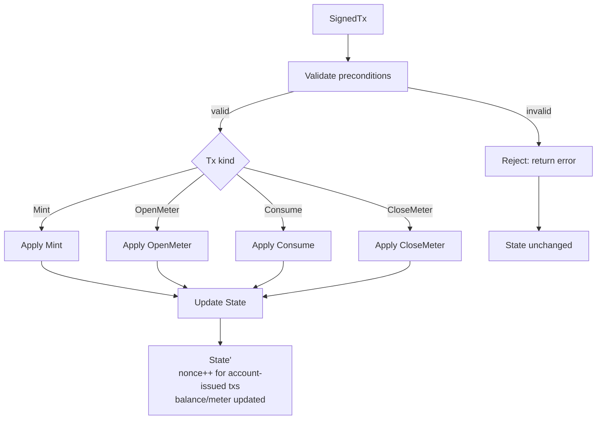

# Domain Specification — Metering Chain

## Overview
Metering Chain models **service usage and billing** as a deterministic state machine.
The domain focuses on metering correctness rather than product workflows.

---

## Core Domain Concepts

### Account (Aggregate)
Represents a payer with balance and transaction ordering.

**State**
- `balance: u64`
- `nonce: u64`

**Invariants**
- Balance never becomes negative
- Nonce is strictly increasing per account

---

### Meter (Aggregate)
Represents a usage ledger for a specific service owned by an account.

**Identity**
- `(owner, service_id)`

**State**
- `total_units: u64` — cumulative usage
- `total_spent: u64` — cumulative cost paid
- `active: bool` — whether the meter accepts consumption
- `locked_deposit: u64` — committed funds (refunded on closure)

**Lifecycle States**
- **Inactive**: meter exists but does not accept consumption (after CloseMeter)
- **Active**: meter accepts consumption transactions (after OpenMeter)

**Lifecycle Transitions**
- **OpenMeter**: Creates a new meter or reopens a closed meter
  - If meter does not exist: create with `total_units = 0`, `total_spent = 0`, `locked_deposit = deposit`
  - If meter exists but is inactive: reactivate, preserve `total_units` and `total_spent`, set new `locked_deposit = deposit`
- **CloseMeter**: Active → Inactive, returns `locked_deposit` to balance

**Invariants**
- Only the owner (or a valid delegate for Consume) may operate the meter; CloseMeter is owner-only in v1.
- At most one active meter per `(owner, service_id)`
- `total_units` and `total_spent` are monotonic
- `locked_deposit` represents committed funds

---

## Domain Commands (Transactions)

Commands represent **intent**, not state patches.

### Mint
Creates new funds (authority-only).

**Parameters**
- `from: String`
- `to: String`
- `amount: u64`

**Rules**
- `from ∈ authorized_minters`
- Target account must exist or be created

---

### OpenMeter
Creates a new meter for a service, or reopens a closed meter.

**Parameters**
- `signer: String`
- `nonce: u64`
- `owner: String`
- `service_id: String`
- `deposit: u64`

**Rules**
- `signer == owner`
- `accounts[signer].nonce == nonce`
- `deposit > 0`
- Owner balance ≥ deposit
- No existing active meter for `(owner, service_id)`

**Behavior**
- If meter does not exist: create new meter with zero totals
- If meter exists but is inactive: reactivate, preserve historical totals, set new deposit

---

### Consume
Records usage and deducts cost.

**Parameters**
- `signer: String`
- `nonce: u64`
- `owner: String`
- `service_id: String`
- `units: u64`
- `pricing: Pricing`
- Optional (Phase 3): `nonce_account`, `valid_at`, `delegation_proof` for delegated Consume

**Rules**
- **Authorization:** `signer == owner` **OR** signer has a valid delegation proof for `(owner, service_id)` (owner-signed proof, within expiry and caveats). Delegated Consume requires payload_version v2.
- **Nonce:** the nonce consumed is that of the *nonce account* (owner when delegated, otherwise signer); `accounts[nonce_account].nonce == nonce`.
- Meter exists and is active
- `units > 0`
- Pricing parameters are strictly positive (`UnitPrice(price)` where `price > 0`, or `FixedCost(cost)` where `cost > 0`)
- Owner balance ≥ computed cost
- Cost computation must not overflow

---

### CloseMeter
Closes a meter and returns locked deposit.

**Parameters**
- `signer: String`
- `nonce: u64`
- `owner: String`
- `service_id: String`

**Rules**
- `signer == owner`
- `accounts[signer].nonce == nonce`
- Meter exists and is active

---

## Transaction Flow



**Validation checks:**
- Nonce monotonicity for the account that supplies the nonce (owner for delegated Consume, signer otherwise)
- Authorization (Mint: `from ∈ authorized_minters`; Consume: `signer == owner` or valid delegation; OpenMeter/CloseMeter: `signer == owner`)
- Sufficient balance (for deposits/consumption)
- Meter state (exists, active, uniqueness)
- Pricing/units validity

**State updates:**
- Account balance changes
- Account nonce increment (account-issued txs only)
- Meter state changes (active, totals, deposit)

---

## Pricing

Pricing must be explicit to avoid ambiguous cost calculation.

```rust
enum Pricing {
    UnitPrice(u64),   // units × price
    FixedCost(u64),   // fixed total cost
}
```
